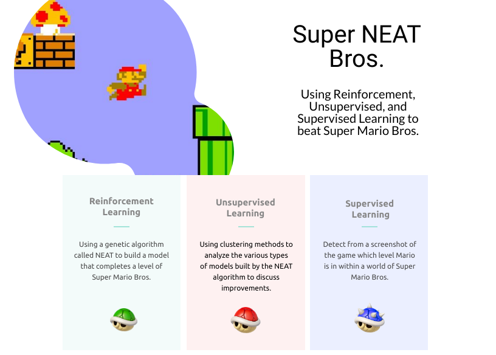

# Super NEAT Bros. Touchpoint 1

Aidan Albers, Jeremy Webb, Zachary Baskin, Zachary Minot

## Summary

## Introduction/Background

Games often have AI that play as Non-player Characters (NPCs). They could be enemies or allies and be as simple
as the aliens in Space Invaders or as complex as the demons and monsters that fight each other in DOOM. However,
wwe looked at this and instead asked,

"What if instead the AI *played* the game?"

To choose the game, we recognized that we should probably try this first on an older game. Older games are much easier to both control
(due to often having less complicated and controls overall) and extract into data for our model
(due to often using tilesets). Super Mario Bros. is a classic game for the Nintendo Entertainment System that has very few controls:
right, left, jump, and run. It also has world split into a tileset that allows us to easily view the game as a grid. As a bonus,
the goal of Super Mario Bros. is as simple of an idea as getting to the flag at the right of the world. The game is also run on an emulator on a PC for
both functionality and feasability.

## Methods

We plan on utilizing the power of NEAT algorithms to train our model. 
NEAT stands for NeuroEvolution of Augmented Topologies, and is a genetic algorithm that continually evolves neural networks. 
This process is derived from evolution in nature where, over the course of centuries and millennia, the best features 
are implemented into the next generation while the worst features are weeded out. The crux of this method is that it 
trains the model by making a plethora of mistakes in order to succeed.

Applying this concept to a level of Mario, the network will start with essentially zero information, 
making random moves until it gets stuck or dies. The player object will go through multiple generations, 
learning where to go and which enemies to avoid. This process can take some time, anywhere from an hour 
to over a day of learning, until the player object successfully completes the level without dying and 
potentially better than human players.

We also plan on implementing a clustering analysis (likely GMM/EM) of the various models we create, to see which one's worked and which one's didn't and why.

To extend this even further, we want the ability to detect which level Mario is in within some reasonable bounds (e.g. the first world). This will likely be using CNNs and screenshots of the game without the UI.

## Results

As a base goal, we want the computer to be able to complete a level of a mario game, 
no matter the time it takes.

Next, we want to introduce an incentive to complete a level will be doing so faster than a skilled human can. 
We intend to “reinforce” the computer to finish levels faster. We will be satisfied with the 
algorithm when it is able to beat us in finishing the level even after we have practiced for a while.

After successfully training the computer to complete a single level, we hope to implement the same 
algorithm on multiple different levels to assess its adaptability. The computer should be able to 
learn how to play almost any standard level it comes across after it has been trained.  So, after the computer has 
trained on a wide variety of levels, we want it to be able to play any other level with only a little 
difficulty the first time through, just like a skilled human can.

For the analysis, we want to be able to apply our learned information to better program our NEAT algorithm.

## Discussion

The best physical outcome for this project would be the generation of a model to play through each level of
Super Mario Bros. without dying--maybe with at least a little training beforehand.

We also hope at a high level this explore more into the generalization of models when using NEAT to play
video games, and possibly explore into training a model to play more complex games like Kirby. 

We also hope to get a reasonable accuracy on the level detection.

## References

[Evolving neural networks through augmenting topologies](http://nn.cs.utexas.edu/downloads/papers/stanley.ec02.pdf)  
KO Stanley, R Miikkulainen - Evolutionary computation, 2002 - MIT Press

[Efficient Exploration In Reinforcement Learning](http://citeseerx.ist.psu.edu/viewdoc/summary?doi=10.1.1.45.2894)  
Sebastian B. Thrun - 1992

[Efficient Reinforcement Learning Through Evolving Neural Network Topologies](http://nn.cs.utexas.edu/?stanley:gecco02b)  
Kenneth O. Stanley and Risto Miikkulainen - 2002

[Dota 2 with Large Scale Deep Reinforcement Learning](https://arxiv.org/abs/1912.06680)  
OpenAI: Christopher Berner and Greg Brockman and Brooke Chan and Vicki Cheung and Przemysław Dębiak and Christy Dennison and David Farhi and Quirin Fischer and Shariq Hashme and Chris Hesse and Rafal Józefowicz and Scott Gray and Catherine Olsson and Jakub Pachocki and Michael Petrov and Henrique Pondé de Oliveira Pinto and Jonathan Raiman and Tim Salimans and Jeremy Schlatter and Jonas Schneider and Szymon Sidor and Ilya Sutskever and Jie Tang and Filip Wolski and Susan Zhang - 2019
