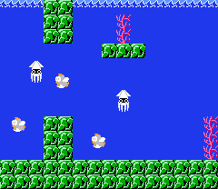

# Super NEAT Bros. Midterm Report

Aidan Albers, Jeremy Webb, Zachary Baskin, Zachary Minot

## Summary

## Introduction/Background

Games often have AI that play as Non-Player Characters (NPCs). They could be enemies or allies as simple
as the aliens in Space Invaders or as complex as the demons and monsters that fight each other in DOOM. However,
we thought,

"What if instead the AI *played* the game?"

To choose the game, we recognized that we should probably attempt an older game. Older games are much easier to both control
(due to often having less complicated and controls overall) and extract into data for our model
(due to often using tilesets).
Super Mario Bros. is a classic game for the Nintendo Entertainment System that has very few controls:
right, left, jump, and run. It also has world split into a tileset that allows us to easily view the game as a grid. Additionally,
the goal of Super Mario Bros. is as simple as getting to the flag at the right of the world. The game is run on an emulator on a PC for
both functionality and feasability. We've seen this done on Super Mario Bros by Sethbling, a Youtube content creator, but the specific implementation
he used was not very successful. We plan to adapt his algorithm and improve it to search for better results.

Although this is intriguing, we thought we could explore more in similar ideas. Speedrunners, people who
play games in attempt to complete them the fastest, not only memorize inputs but entire layouts of levels.
Often times they can recognize levels just based on a few key block placements or a certain enemy position.
This then lead us to ask the question,

"If the AI can play the game, can it then *memorize* it?"

Thus, the second problem of our project was born. Can a machine look at a the screen of Super Mario Bros. and
detect which level that screen is on? One trick is that there is a level counter on the game, so we would need to remove it.
At its whole, the artificial intelligence would be able to look at a slice of a level of mario, and without the
level indicator, detect which level mario is currently in.

## Methods

### Playing the Game
[Just like Sethbling](https://www.youtube.com/watch?v=qv6UVOQ0F44), we are utilizing the power of NEAT algorithms to train our playing model.
NEAT stands for NeuroEvolution of Augmented Topologies, and is a genetic algorithm that continually evolves neural networks. 
This process is derived from evolution in nature where, over the course of centuries and millennia, the best features 
are implemented into the next generation while the worst features are weeded out. The crux of this method is that it 
trains the model by making a plethora of mistakes in order to succeed.

Applying this concept to a level of Mario, the network starts with essentially zero information, 
making random moves until it gets stuck or dies. The player object goes through multiple generations, 
learning where to go and which enemies to avoid. This process can take some time, anywhere from an hour 
to over a day of learning, until the player object successfully completes the level without dying and 
potentially better than human players.

We also plan on implementing a clustering analysis (likely GMM/EM) of the various models we create, to see which ones worked and which ones didn't and why.

### Memorizing the game

To extend this even further, we want the ability to detect which level Mario is in across the entire game without the level indicator. 
We are using classification via Convolutional Neural Networks (CNNs). CNNs are a regularized version of fully connected networks
that use the power of convolutional kernels defined by a width and height passed through a filter to achieve regularization and translation invariance.
The key aspect of CNNs for our project is the translation, or shift, invariance, meaning that certain definined features translated in some way
around are treated as equal, rather than different. CNNs also have a less chance of overfitting the training data, which is an obvious plus.
Commonly used in image and video recognition, we believed this would be a great class of network to use for our object.

Specifically, a successful classification would look like inputting a screen sized image of a Super Mario Bros. level into the network,
without the level indicator, and the output would be the correct classification of the level which the image is from.
There are 32 level classes - 4 levels from 8 worlds.
We are hoping that with CNNs' shift invariance, the model will be able to find key features of each level and recognize them
wherever on the screen, as opposed to the fully connected's method of detection.

We are using 208x240 pixel slices cut out ourselves from the full Super Mario Bros. level maps
from [this website](https://nesmaps.com/maps/SuperMarioBrothers/SuperMarioBrothers.html).
The extended and reduced image size of these level images make for slightly faster computation and
easier acquisition of the actual dataset.

## Desired Results

### Playing the Game
As a base goal, we want the computer to be able to complete a level of a mario game with a better time than the
control (the unedited reference script). This will reduce training time significantly to allow for extension. We can likely
accomplish this through multiple means, via increasing information put into the algorithm or
rewarding certain beneficial changes more than others.

Next, we want to introduce an incentive to complete a level faster than a skilled human can. 
We intend to “reinforce” the computer to finish levels faster. We will be satisfied with the 
algorithm when it is able to beat us in finishing the level even after we have practiced for a while.

After successfully training the computer to complete a single level, we hope to implement the same 
algorithm on multiple different levels to assess its adaptability. The computer should be able to 
learn how to play almost any standard level it comes across after it has been trained.  So, after the computer has 
trained on a wide variety of levels, we want it to be able to play any other level with only a little 
difficulty the first time through, just like a skilled human can. This is likely a problem of generalization,
and requires a careful balance.

For the unsupervised analysis, we want to be able to apply our learned information to better program our NEAT algorithm.
This is likely done through identifying which features cluster towards higher scores and what features all levels generate.

### Memorizing the game

The overall goal here is to be able to detect the level input using the CNN.
An accuracy above 90% would be ideal, but we don't exactly know how achievable this is with all levels combined.
Another thing to consider are the underground/secret portions of levels. Some of these are copy/pasted directly from one level
to the next, so we wonder if we could still include them or do we have to purge them from the dataset.

In the end, we also want to be able to determine which levels were the hardest for the model to distinguish so that we may improve the
design in the future.

## Midterm Development

### NEAT Algorithm

|  |
|:--:|
| *An example of what the NEAT Algorithm looks like in action.* |

At the moment, we have a working NEAT algorithm that is applied to the game Super Mario Bros. Our program runs using the BizHawk emulator, and was heavily inspired by [this great video](https://www.youtube.com/watch?v=qv6UVOQ0F44) by Seth Bling. The NEAT algorithm is a reinforcement learning model, so that means that our model learned by making entirely random moves. The model has rewards based on how far the agent got in the level and punishments based on both the lack of movement and encountering an enemy.

|  |
|:--:|
| *The green lines represent positive connections, while the red lines represent negative connections.* |

Each attempt has an associated fitness score based on these factors, and a new attempt is made when the agent either dies or stays still for too long. Each of these attempts at completing the level is considered a different “species” in each generation. After enough attempts are recorded, a new generation is created with the species that had the maximum fitness recorded. 

|  |
|:--:|
| *The data associated with each generation. The fitness number is the key piece of data for the algorithm.* |

Variations of this species are implemented into this next generation, and after enough generations, the agent will learn what button inputs are necessary to complete the level at specific times. After training the model for over forty-eight hours and sixty generations, the agent was able to successfully complete the first level of Super Mario Bros.

### Level Classifier

So far, we were able to crop, clean, and process the image data for each level of the game, 
analyze the color quantities with KMeans clustering, and produce a supervised, accurate level identification model for the first world. 

To avoid trivial level classification with the level indicator, we grabbed the full maps of each 
level from [this online source](https://nesmaps.com/maps/SuperMarioBrothers/SuperMarioBrothers.html) 
*without* the game HUD. This standardized our image height to 208 pixels, and then the maps were then 
sliced with a 240-pixel-width “sliding window”, with a stride of 4. This size is around the size of the screen
displayed via an emulator. The method produces around 800 images for most levels.
Some level have higher or lower image counts due to level length, but this should not affect the data.

|  |
|:--:|
| *An example image slice from the first world.* |

For our images, we know some levels will likely be similar and we want to understand which of the levels the classifier would likely
have a hard time distinguishing. Since the NES only has a specific number of colors available, we decided to count up
these colors for each individual image slice. To do this, we had to take each RGB value from the image, turn the value into byte form,
and count up each unique value. This produced a 37 dimensional vector for each image.

To determine which levels were similar in color to one another, we decided KMeans was the simplest way to do so.
GMM/EM might conform better, but we want hard assignments in terms of color quantity. When we ran this entire dataset 
through the KMeans Elbow Method via scikitlearn, we got the best results at 12 clusters.

|  |
|:--:|
| *The elbow method visualization. Attempted from n_clusters of 4 to 50.* |

The results at 12 clusters showed the parts of levels were similar enough in color quantity to result
in two or more different images from different levels to be labelled under the same cluster. Although this shows
that classifying all the levels will be fairly difficult, it helped us understand which levels were likely to be
mistaken for one another by the model. For example, levels 2-2 and 7-2 are almost identical. In fact, 
the levels are the exact same layout but with more Bloopers (squid enemies), as seen below:

| &nbsp;&nbsp;&nbsp; | 
|:--:| 
| *Image slices from 2-2 and 7-2 respectively. The underwater levels are especially quite difficult to tell the difference between. Note the only change is the addition of the Blooper on the left side of the image.* |

We can also take apart a single level and analyze what each cluster looks like. For simplicity let's take the cluster assignments
of each snippet of 1-1 and show the proportions of each assigned cluster.

|  |
|:--:| 
| *The cluster assignment for all the image slices of 1-1.* |

Now if we take example slices for each, we can show what the general color of each cluster looks like.

|  |  | 
|:--:| :--:| 
| *Example from Cluster 1. Notice the large amount of blue from the sky, with lesser proportion of the reddish-brown of the ground* | *Example from Cluster 10. Now there is a considerable more proportion of the reddish-brown due to the block ramp, leading to a different cluster assignment.* |

If we do this for all clusters, we can actually see the different 'colors spaces' in each level, and compare each level's pie graph
immediately
(not shown though, because it takes a while and takes up a large amount of space)
 
To further delve into this section, we then created a basic convolutional neural network for the first world using Pytorch, with two convolution layers and three 
fully connected layers. The input is the aforementioned 208x240 image slice, and the output is a 4 dimensional probability vector, 
with each dimension corresponding to the probability that the input is for one of the possible 4 levels in the 
first world. Our optimizer was Adam, and the loss we used was cross entropy, mostly because these we were the ones we were most familiar with.
We split our data into 80% training and 20% testing. After training the model, we ended with a 95% accuracy on the 
test set. With a batch size of 16 and only one epoch, we achieved these results. When we attempted to add more epochs,
the model overfit due to the small amount of classes.

|  | 
|:--:| 
| *The network visualized as a diagram. Relu and batch norm layers are omitted.* |

Pretty awesome, but we know that classifying all 32 levels will be much more difficult.

## Challenges

### NEAT Algorithm

There are several challenges that may arise when attempting to apply a NEAT algorithm to some problem. For us, it seems to be finding the right hyper-parameters and reward system to make the long training times worth our while. New obstacles always prove to be a problem, taking the agent hours at a time to learn a way to conquer them. This "specilization" of a single obstacle can also be detrimental in its ability to beat obstacles that previously caused no problems, just making matters worse. Moving forward, we plan on experimenting more with batch sizes and fine tuning our parameters and reward function to see if better training is possible. We also want to have multiple different parametered models training on each of our computers to help with the tuning of our parameters. All in all, these are good first steps to better our understanding of the data we are working with and how to get it to work for us. We hope that with more time and training we can get the NEAT algorithm to play mario better than us.

### Level Classifier

Since this game is rather old, the level design and color palette used throughout the levels is very similar. This makes classifying each level quite a challenge as pixel composition from level to level does not vary greatly. There are exceptions, but just from looking at the cluster assignemnts of 2-2 and 7-2 it is evident some levels have exceptional overlap.

| &nbsp;&nbsp;&nbsp; | 
|:--:|
|*Cluster assignemnts of levels 2-2 and 7-2. Notice how they were assigned to the same cluster making them nearly impossible to tell apart* |

Currently, we are getting good results for the first level but would like to see accurate classification throughout the entire game. In an effort to achieve this, we may have to change the way we collect data about each of the levels as well as experimenting with different clustering methods and varying the number of cluster centers.

## Discussion

The best physical outcome for this project would be the generation of a model to play through each level of
Super Mario Bros. without dying--maybe with at least a little training beforehand.

Furthermore, at a high level, we hope this will entice us to explore more into the generalization of models when using NEAT to play
video games, and possibly explore into training a model to play more complex games like Kirby.

We also hope to get a reasonable accuracy on the level detection across all levels, and understand how the
CNN memorizes the level. This could be further understood through weight maps like GradCAM.

Also, we could extend the model to include more than just Super Mario Bros. and possibly "Super Mario Bros.: The Lost Levels" or
even "Super Mario Bros. 3".

## Final Development

### NEAT Algorithm

### Level Classifier

## Final Discussion

## References

[Evolving neural networks through augmenting topologies](http://nn.cs.utexas.edu/downloads/papers/stanley.ec02.pdf)  
KO Stanley, R Miikkulainen - Evolutionary computation, 2002 - MIT Press

[Efficient Exploration In Reinforcement Learning](http://citeseerx.ist.psu.edu/viewdoc/summary?doi=10.1.1.45.2894)  
Sebastian B. Thrun - 1992

[Efficient Reinforcement Learning Through Evolving Neural Network Topologies](http://nn.cs.utexas.edu/?stanley:gecco02b)  
Kenneth O. Stanley and Risto Miikkulainen - 2002

[Dota 2 with Large Scale Deep Reinforcement Learning](https://arxiv.org/abs/1912.06680)  
OpenAI: Christopher Berner and Greg Brockman and Brooke Chan and Vicki Cheung and Przemysław Dębiak and Christy Dennison and David Farhi and Quirin Fischer and Shariq Hashme and Chris Hesse and Rafal Józefowicz and Scott Gray and Catherine Olsson and Jakub Pachocki and Michael Petrov and Henrique Pondé de Oliveira Pinto and Jonathan Raiman and Tim Salimans and Jeremy Schlatter and Jonas Schneider and Szymon Sidor and Ilya Sutskever and Jie Tang and Filip Wolski and Susan Zhang - 2019

[MarI/O - Machine Learning for Video Games](https://www.youtube.com/watch?v=qv6UVOQ0F44)
[Link to reference script](https://pastebin.com/ZZmSNaHX)
Sethbling, [check out his awesome videos](https://www.youtube.com/channel/UC8aG3LDTDwNR1UQhSn9uVrw)

[Parallel distributed processing model with local
space-invariant interconnections and
its optical architecture](https://drive.google.com/file/d/0B65v6Wo67Tk5ODRzZmhSR29VeDg/view)
Wei Zhang, Kazuyoshi Itoh, Jun Tanida, and Yoshiki Ichioka
